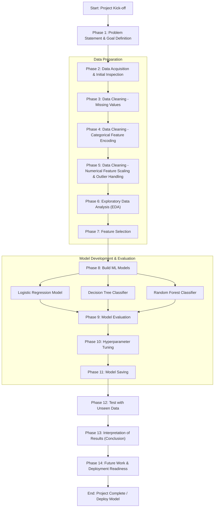

# Network Filter
A high perfomant model which can efficiently and precisely predict whether a connection is normal or some sort of network attack. Trained with over 80,000 rows and tested with over 25,000 rows.

